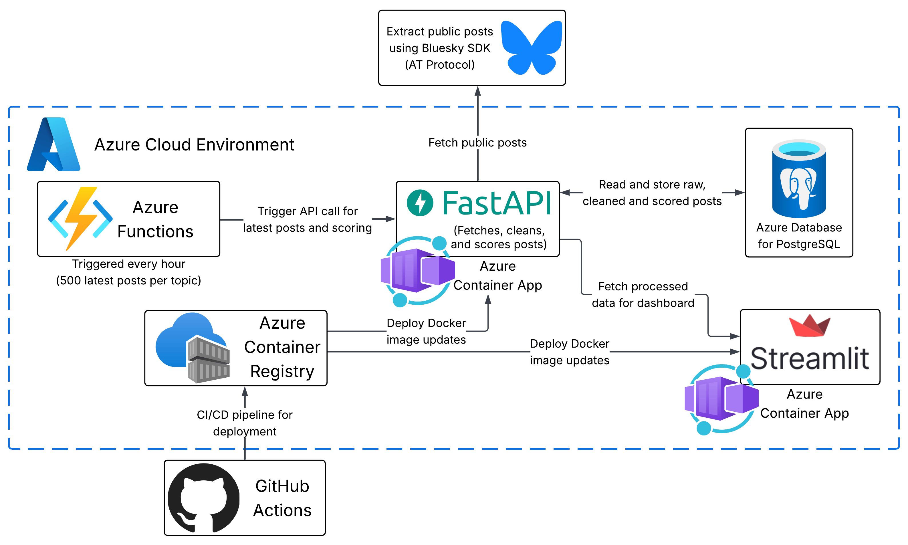

# SentiCheck

A sentiment analysis platform that collects public posts from Bluesky, analyzes their sentiment and displays insights through an interactive dashboard.

**Live Dashboard**: [SentiCheck Dashboard](https://senticheck.dev/)

## Why This Matters

SentiCheck analyzes public sentiment on Bluesky to reveal how communities feel about specific topics in real time. Unlike traditional surveys or polls, this platform captures organic conversations as they happen, providing authentic insights into public opinion on the topics of your choice.

The platform automates the entire process, from data collection to sentiment scoring to visualization, making it simple to track how conversations evolve over time. Whether you're researching social media discourse, building sentiment analysis skills, or exploring public opinion trends, SentiCheck provides the tools to analyze thousands of posts at scale.

## Features

- **Automated Data Collection**: Hourly collection of posts from Bluesky based on keywords
- **AI Sentiment Analysis**: Uses Hugging Face transformer models to analyze sentiment
- **Interactive Dashboard**: Real-time visualization of sentiment trends and distributions
- **Keyword Tracking**: Monitor multiple topics simultaneously
- **Trend Analysis**: See how sentiment changes over time
- **Word Clouds**: Visual representation of frequently used words

## Technology Stack

### Data Pipeline

- **Azure Functions**: Serverless orchestration for automated data collection
- **Python**: Main programming language
- **Bluesky AT Protocol**: Social media data source

### Machine Learning

- **FastAPI**: ML service for sentiment analysis
- **Hugging Face Transformers**: Pre-trained sentiment model

### Data & Storage

- **Azure Database for PostgreSQL**: Managed database for storing posts and sentiment scores
- **Azure Container Apps**: Hosting for API and dashboard
- **Azure Container Registry**: Docker image storage

### Visualization

- **Streamlit**: Interactive dashboard framework
- **Plotly**: Charts and visualizations
- **WordCloud**: Text visualization

### DevOps

- **Docker**: Containerization
- **GitHub Actions**: CI/CD automation
- **Azure Cloud**: Infrastructure

## Project Structure

```
senticheck/
├── api_service/             # FastAPI ML service
│   ├── main.py              # API endpoints
│   ├── models/              # Database models
│   ├── services/            # Business logic
│   └── utils/               # Sentiment analyzer
├── dashboard/               # Streamlit dashboard
│   ├── app.py               # Main dashboard
│   ├── charts/              # Chart components
│   ├── components/          # UI components
│   └── styles/              # Custom styling
├── azure-functions/         # Serverless orchestration
│   ├── function_app.py      # Pipeline orchestrator
│   └── utils/               # API client
├── .github/workflows/       # CI/CD pipelines
│   ├── deploy-api-service.yml
│   └── deploy-dashboard.yml
└── requirements.txt         # Python dependencies
```

## How It Works

### Data Pipeline Flow

1. **Collection**: Azure Functions run hourly, fetching posts from Bluesky
2. **Cleaning**: Text is cleaned and preprocessed
3. **Analysis**: ML model analyzes sentiment (positive/negative/neutral)
4. **Storage**: Results stored in Azure Database for PostgreSQL
5. **Visualization**: Dashboard displays insights in real-time

### Architecture



## Dashboard Features

### Sentiment Distribution

- Pie chart showing overall sentiment breakdown
- Real-time percentage calculations
- Color-coded by sentiment type

### Sentiment Trends

- Line charts showing sentiment over time
- Compare positive, negative, and neutral trends
- Customizable date ranges

### Volume Analysis

- Track posting volume over time
- Identify peak activity periods
- Daily post counts

### Word Clouds

- Visual representation of common words
- Color-coded by sentiment
- Adjustable word count

## Deployment

The application uses automated CI/CD with GitHub Actions:

- **Push to main branch** → Automatic deployment to Azure
- **API Service**: Deploys when `api_service/` changes
- **Dashboard**: Deploys when `dashboard/` changes
- **Functions**: Deploy manually (limitation with Azure student account)

All services run on Azure cloud infrastructure with automatic scaling.

## Data Source

This project collects public posts from **Bluesky Social Network** using the AT Protocol API.

**Data Attribution:**

- **Source**: Bluesky Social (public posts only)
- **Collection Method**: AT Protocol API
- **Data Type**: Public text posts and metadata

All data collection follows Bluesky's terms of service and API guidelines.

## License

This project is licensed under the MIT License.

## Author

**Marco Vieto Vega** (marcovietovega)

## Version History

- **v2.0**: Migrated to Azure serverless architecture

  - Azure Functions for orchestration
  - Container Apps for API and Dashboard
  - Automated CI/CD pipelines

- **v1.0**: Initial release
  - Basic sentiment analysis
  - Airflow-based orchestration
  - Local deployment

---

**Understand social media sentiment with SentiCheck**
